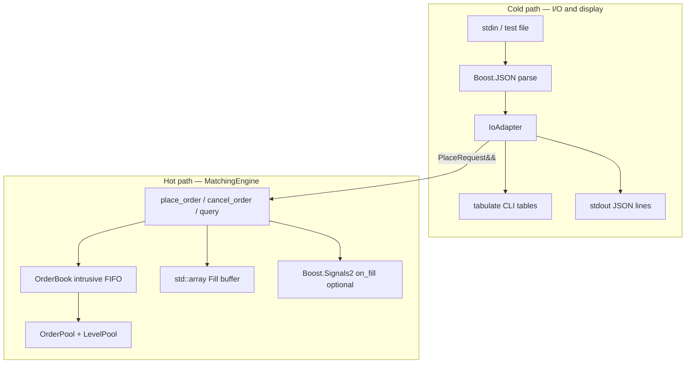
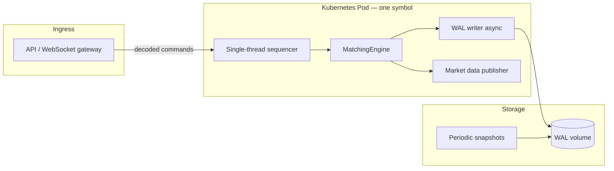

# Matching Engine

Single-market **continuous limit order book** (C++20) built for the Infinite Worlds exchange take-home (Part 1). One symbol, price-time priority, **deterministic** matching, and an **ultra-low-latency** hot path separated from JSON I/O.

---

## Table of contents

1. [Assignment coverage](#assignment-coverage)
2. [Design approach](#design-approach) — architecture, latency, determinism, data structures
3. [Production deployment](#production-deployment-and-roadmap) — Docker, Kubernetes, prod-ready changes
4. [Project layout](#project-layout)
5. [Clone, dependencies, and build](#clone-and-install-dependencies)
6. [Run tests](#run-tests)
7. [CLI and benchmark](#cli-usage)
8. [Contributor notes](#contributor-notes)

---

## Assignment coverage

| Requirement | Supported |
|-------------|-----------|
| Place **limit** orders (buy / sell) | Yes |
| Place **market** orders (buy / sell) | Yes — omit `price` or `"price": null` |
| **Cancel** by `order_id` | Yes |
| **Query** top of book | Yes |
| **Query** full book depth | Yes |
| **Query** single resting order | Yes |
| **GTC** / **IOC** | Yes |
| **Post-only** (nice-to-have) | Yes — `"post_only": true` |
| Price-time priority | Yes |
| Self-trade prevention | Yes — **cancel newest (taker)** |
| Partial fills (GTC maker keeps queue position) | Yes |
| **Deterministic** fills and book state | Yes — `test_determinism.sh` (replay `cmp`, golden SHA256, 8× stress loop) |
| Single-threaded engine + scripted CLI | Yes |

**Explicitly out of scope (per brief):** authentication, persistence, recovery, collateral, multi-market sharding, HTTP/WebSocket server.

---

## Design approach

This section is the project writeup: why the engine is shaped this way, how ultra-low latency is pursued, and how determinism is guaranteed.

### Design goals

| Goal | How we pursue it |
|------|------------------|
| **Correctness** | Price-time priority, explicit self-trade / IOC / post-only / partial-fill rules |
| **Determinism** | Single-threaded state machine; engine-owned IDs and timestamps; no randomness or wall-clock in the matcher |
| **Ultra-low latency** | Hot path with no heap alloc, no JSON, no copies; pools + intrusive lists + integer prices |
| **Clean boundary** | `MatchingEngine` is pure matching; `IoAdapter` + CLI own all string/JSON work |
| **Testability** | JSON line replay + `verify_tests.sh` + `test_determinism.sh` (byte-identical replays, golden hash) |

### Architecture: hot path vs cold path

The system is split so anything “slow” or allocating never runs inside matching.



| Layer | Files | Runs when |
|-------|--------|-----------|
| **Hot** | `matching_engine.cpp`, `order_book.cpp`, `memory_pool.hpp`, `types.hpp` | Every order, cancel, match |
| **Cold** | `io_adapter.cpp`, `cli_display.cpp`, `main.cpp` | Parse input, serialize output, pretty print |
| **Measure** | `benchmark.cpp` | `me_benchmark` only — calls engine directly, no JSON |

**Rule used throughout development:** if a change allocates, copies strings, or parses JSON inside `MatchingEngine`, it belongs in the cold path instead.

### Ultra-low latency techniques

These are deliberate choices for the order → match → fill path (HFT-style, within a take-home scope).

#### 1. Pre-allocated memory pools (no heap on hot path)

- **OrderPool:** fixed `std::array` of 65,536 `OrderSlot`s + free list for allocate/free.
- **LevelPool:** fixed 4,096 price levels + free list.
- **No `new` / `delete`** while placing, matching, or canceling resting orders.

Pool slots are reused via a deterministic free list; logical identity is **`order_id`**, not slot index.

#### 2. Move-only handles, zero copy of orders on the hot path

- `OrderHandle` is **move-only** (copy deleted).
- Resting liquidity is referenced by **slot index** and intrusive links, not `std::vector<Order>` copies.
- `PlaceRequest` is passed as **`PlaceRequest&&`** into `place_order`.

#### 3. Integer price ticks (no float in the matcher)

- Prices are converted once at the JSON boundary: `llround(price × 10⁸)` → `int64_t` ticks.
- All cross checks and level keys use **integer comparison** on the hot path (no FP drift during matching).

#### 4. Intrusive doubly linked lists per price level

- Each price level is a **FIFO queue**: `head` / `tail` + `prev` / `next` indices into the order pool.
- **Insert resting order:** O(1) append at tail.
- **Cancel:** O(1) unlink (no shifting a `std::deque`).
- **Match:** walk from `head` (time priority) at the best price level.

This avoids `std::deque::erase` in the middle and avoids tree/map nodes that heap-allocate.

#### 5. Cached best bid / best ask

- `best_bid_level_` and `best_ask_level_` are updated when levels are inserted or removed.
- Matching starts at **`book_.best_level(opp)`** — O(1) best price, then walks the level chain for worse prices.

#### 6. Open-addressing maps (pre-sized, probe only)

- **order_id → slot index:** linear probing in a fixed array (with tombstones on erase).
- **price_ticks → level index:** separate maps for bids and asks.
- Lookups are bounded array probes — no `std::unordered_map` rehash on the hot path.

#### 7. Fixed-size fill buffer

- Fills for one operation go into `std::array<Fill, MAX_FILLS_PER_OP>` with a count — **no `vector` growth** during a match burst.

#### 8. C++20 and Release builds

- C++20 for clear, strict code (`nodiscard`, `noexcept` on hot helpers).
- CMake **Release** with **`-O3`** on GCC/Clang for speed, plus **deterministic-safe** flags (no fast-math) — see [Compiler flags and determinism](#compiler-flags-and-determinism).

#### 9. Benchmark without JSON

- `me_benchmark` links the engine only and times place/cancel/match loops — measures hot path without parse/serialize noise.

**What we did not implement (production HFT extras):** kernel bypass, NUMA pinning, shared-memory multicast, SIMD, lock-free queues between threads, custom allocators per thread, or hardware timestamping. The brief is single-market and single-threaded; the above is the right level for this repo.

### Data structures (and why not `std::map`)

| Structure | Role | Why this shape |
|-----------|------|----------------|
| **OrderPool** | All live orders | Fixed array + free list; O(1) alloc/free |
| **LevelPool** | Price levels | Fixed array; each level has FIFO head/tail |
| **Price level chain** | Sorted bids (desc) / asks (asc) | Doubly linked list of levels from `best_*` |
| **OrderIdMap** | Cancel / query by id | Open addressing; verify `order_id` on hit |
| **TickLevelMap** | Find level by price | Open addressing per side |
| **HotResult::fills** | Per-command fill list | Fixed array |

**Why not `std::map` / `std::unordered_map` on the hot path?**  
Tree and hash table implementations typically allocate nodes and can have less predictable cache behavior. For a single-threaded engine with a known cap (64K orders), pools + indices + intrusive lists give **predictable memory and layout**.

### Matching algorithm (price-time)

For each incoming order (taker):

1. Assign **`order_id`** and **`timestamp`** from engine counters (not from the client).
2. If **post-only** and would cross the opposite best price → reject (no match).
3. While taker has remaining size:
   - Take **best opposite level** (`best_ask` for a buy, `best_bid` for a sell).
   - If price does not cross → stop.
   - Walk makers at that level from **head → tail** (FIFO).
   - On self-trade (same `account_id`) → **reject taker**, no fills.
   - Otherwise fill `min(taker.remaining, maker.remaining)` at **maker level price**.
   - Fully filled makers are unlinked and pool slots freed; partial makers stay in queue.
4. If taker still has size:
   - **GTC limit** → rest at **tail** of its limit price level.
   - **IOC / market remainder** → discard (free slot, no rest).

**Partial fill rule:** a partially filled **maker** keeps its position in the FIFO. A partially filled **GTC taker** that rests joins the **tail** of its price level (new liquidity).

### Concurrency model

- **One thread** processes the book: no mutexes, no atomics in `MatchingEngine`.
- **Boost.Asio** `io_context(1)` for async stdin in interactive mode; each line is still handled **serially** on that thread.
- **Tests** use synchronous file replay (`argv` or `INPUT_FILE`) — same determinism as interactive, without timing dependency.

There is **no** concurrent “cancel while another thread matches.” Cancel-during-match in tests means: *partial fill → cancel resting remainder → next command*, all sequential.

### Determinism (the most important property)

> Given the same sequence of inputs, the engine produces the same sequence of fills and book states every time.

#### What makes output repeatable

1. **Sequential state machine**  
   `stateₙ = f(stateₙ₋₁, commandₙ)`. No parallel writers.

2. **Engine-owned sequence numbers**  
   - `next_order_id_`: 1, 2, 3, … on each `place_order` (client never sets id).  
   - `timestamp_`: incremented once per `place_order`; all fills in that call share it.

3. **Fixed matching order**  
   - Best price first (level chain from `best_bid` / `best_ask`).  
   - Within a price, **earliest resting order first** (queue head).

4. **Stable policies**  
   - Self-trade → cancel **newest (taker)**.  
   - Fill price = maker level price.  
   - IOC remainder dropped; post-only reject if cross.

5. **No nondeterministic inputs**  
   No `rand()`, no `std::random`, no wall-clock in matching (benchmark uses `chrono` only for timing).

6. **Deterministic pool reuse**  
   Free-list push/pop order follows the same allocate/free history for the same command stream.

#### Compiler flags and determinism

Matching uses **integer ticks only** on the hot path; floats appear only when parsing JSON prices (`price_to_ticks`). The build explicitly **disables** compiler modes that can change numeric results or reorder math in ways that break replay:

   | Flag / setting | GCC/Clang | MSVC | Purpose |
   |----------------|-----------|------|---------|
   | No fast math | `-fno-fast-math` | `/fp:strict` | Stable `llround` / `double` → ticks at the I/O boundary |
   | No FP contraction | `-ffp-contract=off` | (under `/fp:strict`) | No fused multiply-add surprises |
   | Extra GCC guards | `-fno-unsafe-math-optimizations`, `-fno-associative-math`, `-fno-reciprocal-math` | — | No reordering of FP expressions |
   | Clang | `-fno-approx-func` | — | No approximate math builtins |
   | **Not used** | `-Ofast`, `-ffast-math`, `-funsafe-math-optimizations` (enabled) | `/fp:fast` | Would make identical JSON inputs map to different ticks on some platforms |

   **Release** still uses **`-O3`** (or MSVC **`/O2`**) for latency — inlining and SIMD on **integer** code do not change match order for a fixed command stream. What we avoid is **unsafe floating-point** and **`-Ofast`**-style global semantics changes.

   Configuration lives in `cmake/MeDeterministic.cmake` and is applied to `matching_engine` and `me_benchmark`.

   **Optional verification build (no compiler optimization):**

   ```bash
   cmake -B build-verify -S . \
     -DCMAKE_BUILD_TYPE=Release \
     -DME_DISABLE_COMPILER_OPTIMIZATION=ON \
     -DCMAKE_TOOLCHAIN_FILE="$VCPKG_ROOT/scripts/buildsystems/vcpkg.cmake"
   cmake --build build-verify
   ./build-verify/matching_engine tests/basic.txt > /tmp/o0.txt
   ./build/matching_engine tests/basic.txt > /tmp/o3.txt
   diff /tmp/o0.txt /tmp/o3.txt   # outputs should match
   ```

   Use `-DME_DISABLE_COMPILER_OPTIMIZATION=ON` when you want **`-O0` / `/Od`** to prove that optimized and unoptimized binaries produce the same fills and book (golden replay). Default Release builds keep **`-O3`** for performance.

#### Automated determinism tests

`tests/test_determinism.sh` proves that **every replay fixture** produces **byte-identical** JSON output across repeated runs:

| Check | What it proves |
|-------|----------------|
| **Pairwise replay** | Each `tests/*.txt` run twice → `cmp` identical |
| **Stress loop** | `determinism_stress.txt` run **8×** (override with `ME_DETERMINISM_REPEAT`) → all match run 1 |
| **Golden SHA256** | `tests/determinism_stress.sha256` matches committed hash (regression + stable output) |
| **Event invariants** | FIFO fill (`maker_order_id":1`), post-only reject, self-trade, market sell id on stress file |
| **O3 vs O0 (optional)** | If `build-verify/matching_engine` exists (`-DME_DISABLE_COMPILER_OPTIMIZATION=ON`), stress output matches Release |

```bash
chmod +x tests/test_determinism.sh
./tests/test_determinism.sh

# Included at end of verify_tests.sh / run_tests.sh:
./tests/verify_tests.sh

# CTest:
ctest --test-dir build -R determinism
```

Regenerate golden hash after intentional output changes:

```bash
./build/matching_engine tests/determinism_stress.txt | shasum -a 256
# update tests/determinism_stress.sha256 with the hash
```

#### Verify determinism yourself (manual)

```bash
./build/matching_engine tests/basic.txt > /tmp/a.txt
./build/matching_engine tests/basic.txt > /tmp/b.txt
diff /tmp/a.txt /tmp/b.txt    # should be identical
```

#### Limits

- Same **binary** (same compiler, flags, and `ME_DISABLE_COMPILER_OPTIMIZATION` setting) and same input order are assumed.  
- Float **input** prices are converted at the boundary with **strict FP** flags; extreme cross-platform differences in how the client serializes decimals are out of scope — production would use **integer ticks on the wire** and skip `double` entirely.  
- Not a distributed or multi-writer exchange — single process, single command stream.

### Matching invariants (summary)

| # | Invariant |
|---|-----------|
| 1 | **Price-time:** better price before worse; FIFO within price |
| 2 | **Determinism:** monotonic engine `order_id` / `timestamp` |
| 3 | **Self-trade:** same `account_id` → taker rejected, `"error":"self_trade"` |
| 4 | **Partial GTC maker:** stays in queue position |
| 5 | **IOC:** match available size; unfilled remainder not rested |
| 6 | **Post-only:** reject if order would immediately cross |

### Tradeoffs and skipped scope

| Chosen | Skipped (per brief or scope) |
|--------|----------------------------|
| Pools + intrusive FIFO | HTTP/WebSocket gateway |
| Tick prices (`int64`) | Arbitrary-precision decimal engine |
| Single-threaded actor | Multi-market / sharding |
| JSON CLI replay | Auth, persistence, recovery, collateral |
| Open-addressing maps | Post-trade risk, accounts, fees |

**Cancel-during-match:** modeled as sequential replay (`cancel_during_match.txt`), not concurrent cancel inside the matching loop.

### Third-party libraries (and roles)

| Library | Role | On hot path? |
|---------|------|----------------|
| **Boost.JSON** | Parse/serialize CLI | No |
| **Boost.Asio** | Async stdin, `io_context(1)` | No (I/O only) |
| **Boost.Signals2** | Optional `on_fill` subscribers | Optional hook; tests do not require it |
| **tabulate** | Pretty order book tables (`--pretty`) | No |

Dependencies via **vcpkg** + **CMake**; see build section below.

---

## Production deployment and roadmap

This repository is a **take-home matching core** with a JSON CLI. It is **not production-ready as-is**. Below is how I would **run it efficiently in production**, package it (**Docker** → **Kubernetes**), and what I would **change** before serving real traffic.

### How this runs today vs production

| Today (take-home) | Production target |
|-------------------|-------------------|
| JSON lines on stdin / file replay | Binary gateway (TCP/UDP or shared memory) + internal command queue |
| Single process, one market | **One matcher instance per instrument** (or shard by symbol) |
| In-memory only; restart = empty book | **WAL + snapshot** recovery; deterministic replay |
| No auth, risk, or monitoring | AuthN/Z, rate limits, pre-trade risk, metrics, tracing |
| `me_benchmark` on laptop | Continuous profiling, SLO dashboards, load tests |

The **hot-path design** (pools, intrusive book, single-threaded matcher) is a good *starting point* for one market on one core; production adds **durability, networking, and operations** around that core — not a rewrite to “make it slow.”

### Production runtime model (how I would run it)



**Principles:**

1. **One thread owns the book** — keep the current deterministic matcher; do not add mutexes inside matching.
2. **Pin to CPU** — `isolcpus` / dedicated core per matcher pod (no noisy neighbors on the hot core).
3. **Separate I/O from matching** — gateway parses wire format; matcher receives fixed structs on a **bounded SPSC ring** (cold path off the match core).
4. **Batch WAL / publish** — append-only log and market-data fan-out on another thread or NIC queue; never block match on disk or JSON.
5. **Process-per-symbol (or shard)** — horizontal scale by listing, not by sharing one book across threads.

### Docker: how I would containerize it

**Goals:** reproducible build, minimal runtime image, no compiler in prod, vcpkg deps baked at build time.

**Multi-stage Dockerfile (outline):**

```dockerfile
# Stage 1 — build
FROM ubuntu:24.04 AS builder
RUN apt-get update && apt-get install -y build-essential cmake git curl zip unzip pkg-config
WORKDIR /src
COPY . .
RUN cd vcpkg && ./bootstrap-vcpkg.sh
ENV VCPKG_ROOT=/src/vcpkg
RUN cmake -B build -S . -DCMAKE_BUILD_TYPE=Release \
    -DCMAKE_TOOLCHAIN_FILE=$VCPKG_ROOT/scripts/buildsystems/vcpkg.cmake \
    && cmake --build build --target matching_engine

# Stage 2 — runtime (distroless or slim)
FROM gcr.io/distroless/cc-debian12
COPY --from=builder /src/build/matching_engine /usr/local/bin/matching_engine
# Production binary would be matching_engine_prod with gateway, not JSON stdin
ENTRYPOINT ["/usr/local/bin/matching_engine"]
```

**Docker practices I would use:**

| Practice | Why |
|----------|-----|
| **Multi-stage build** | Small image; no vcpkg/toolchain in prod |
| **Build in CI, not on laptop** | Same image digest everywhere |
| **Non-root user** | `USER 65532` in final stage |
| **Read-only root filesystem** | Immutability; WAL on mounted volume only |
| **No shell in runtime image** | Distroless/scratch reduces attack surface |
| **Resource limits** | `cpus: "2"`, `memory` cap in compose/K8s manifest |
| **Health ≠ liveness only** | Readiness = engine caught up on WAL replay |

**Local efficient run (pre-K8s):**

```bash
docker build -t matching-engine:prod .
docker run --rm -it \
  --cpuset-cpus="2" \
  --memory=512m \
  -v $(pwd)/data/wal:/data/wal \
  matching-engine:prod
```

For the **current** take-home binary, map test replay with a volume; in prod you would replace stdin JSON with a **gateway sidecar** or integrated binary.

### Kubernetes: how I would deploy it

**One Deployment per market** (e.g. `BTC-USD`), not one Deployment trying to scale the same book with multiple replicas.

| K8s object | Purpose |
|------------|---------|
| **Deployment** (replicas: 1 per symbol) | Single writer to the book |
| **Service** (ClusterIP) | Internal gateway → matcher gRPC/SHM |
| **StatefulSet** (optional) | Stable network ID + PVC for WAL per symbol |
| **PodDisruptionBudget** | `minAvailable: 1` during node drains |
| **PriorityClass** | Latency-sensitive matcher pods scheduled first |
| **topologySpreadConstraints** | Spread across zones; accept single-replica constraint |
| **ConfigMap** | Symbol, tick size, pool sizes, feature flags |
| **Secret** | API keys, TLS certs (gateway) |
| **PVC** | WAL + snapshots (fast SSD storage class) |

**Pod spec highlights (conceptual):**

```yaml
spec:
  replicas: 1   # never >1 for the same symbol without sharding redesign
  template:
    spec:
      containers:
        - name: matcher
          image: registry/matching-engine:1.2.3@sha256:...
          resources:
            requests:
              cpu: "2"
              memory: "1Gi"
            limits:
              cpu: "2"
              memory: "2Gi"
          securityContext:
            runAsNonRoot: true
            readOnlyRootFilesystem: true
            allowPrivilegeEscalation: false
          volumeMounts:
            - name: wal
              mountPath: /data/wal
          livenessProbe:
            httpGet: { path: /healthz, port: 8080 }
            initialDelaySeconds: 10
          readinessProbe:
            httpGet: { path: /readyz, port: 8080 }
      volumes:
        - name: wal
          persistentVolumeClaim:
            claimName: matcher-wal-btc-usd
```

**Scheduling for efficiency:**

- **`cpu-manager-policy: static`** and **Guaranteed QoS** (requests = limits) for stable latency.
- **Dedicated node pool** (taints/tolerations `workload=matcher`) — no batch jobs on matcher nodes.
- **Host tuning** (node daemonset): `performance` governor, disable hyperthreading sharing where possible, huge pages if allocator supports it.

**HA / failover:**

- Active-passive per symbol: standby replays WAL, promotes on leader election (etcd/Consul).
- **Not** active-active two writers on one book — that breaks determinism without distributed consensus on every command.

**CI/CD pipeline:**

1. Build image in CI → scan (Trivy) → sign (cosign).  
2. Push to registry with immutable tag.  
3. Roll out via Helm/Argo CD **canary** on gateway first, then matcher (or blue/green with WAL catch-up).  
4. Run `verify_tests.sh` + integration load test in staging before prod promotion.

### What I would change to make it PROD-ready

Grouped by priority.

#### P0 — Must have before real money

| Change | Detail |
|--------|--------|
| **Durability** | Append-only **WAL** of every command + periodic **snapshot**; restart = replay WAL from last snapshot |
| **Wire protocol** | Replace JSON stdin with **fixed binary messages** (SBE, protobuf, or custom); zero-copy decode into `PlaceRequest` |
| **Gateway service** | HTTP/WebSocket-facing tier that validates, auth’s, rate-limits, then forwards to matcher queue |
| **Deterministic replay tests** | CI replays production WAL snippets; byte-compare fills vs golden |
| **Graceful shutdown** | Drain command queue, flush WAL, fsync, then exit (SIGTERM handling in K8s preStop) |
| **Observability** | Prometheus metrics: match latency histogram, queue depth, reject reasons, pool utilization |
| **Structured logging** | JSON logs from cold path only; trace id per order; no `printf` on hot path |

#### P1 — Risk and correctness

| Change | Detail |
|--------|--------|
| **Pre-trade risk** | Max size, max notional, price bands, max orders per account |
| **Post-trade checks** | Assert non-negative remaining, book consistency after each command |
| **Self-trade / STP policies** | Configurable per account/symbol (not only cancel-taker) |
| **Idempotent client order ids** | Dedup at gateway; engine maps external id → internal id |
| **Market halts / auction modes** | Admin commands: pause matching, cancel-all, roll session |
| **FOK / post-only / min qty** | Product rules encoded and tested |

#### P2 — Performance at production scale

| Change | Detail |
|--------|--------|
| **Huge-page / NUMA-aware pools** | Pre-touch memory at startup; bind matcher to NUMA node |
| **Shard order_id / WAL** | Partition only if multi-symbol; one engine per symbol is simpler |
| **SIMD / cache profiling** | `perf`, flamegraphs; only optimize proven hot spots |
| **Kernel bypass (optional)** | AF_XDP/DPDK on gateway NIC — matcher still single-thread |
| **Remove Signals2 from hot path** | Direct callback or lock-free ring to downstream consumers |

#### P3 — Operations and compliance

| Change | Detail |
|--------|--------|
| **Audit trail** | Immutable event store (who placed what, when) |
| **Secrets management** | Vault / K8s secrets; no keys in images |
| **Multi-region** | Primary region writes; DR region async replication + manual failover |
| **Capacity planning** | Load test at 2× peak; define p99 match latency SLO |
| **Runbooks** | WAL corruption, stuck pod, replay procedure, emergency cancel-all |

### What I would keep from this implementation

- **Single-threaded `MatchingEngine`** with pools and intrusive FIFO — proven model for one market per core.  
- **Integer ticks** and **engine-owned sequence numbers** — production determinism and auditability.  
- **Hot/cold split** — gateway + WAL + metrics stay off the match path.  
- **`me_benchmark` / load tests** in CI as regression gates on latency.

### What I would not do in production

- Run the **JSON stdin CLI** on the critical path.  
- Scale matcher **replicas > 1** for the same symbol without a sharding redesign.  
- Share one book across **multiple threads** with locks.  
- Deploy without **WAL + replay** tests after every release.

### Suggested production checklist (release gate)

- [ ] WAL replay from snapshot matches pre-crash state (determinism test)  
- [ ] Load test meets p99 match latency SLO under peak message rate  
- [ ] Docker image scanned; runs non-root; read-only rootfs  
- [ ] K8s probes: `/readyz` false until replay complete  
- [ ] PodDisruptionBudget + graceful termination verified  
- [ ] Metrics and alerts: queue depth, reject rate, WAL lag, pool full  
- [ ] Staging soak test ≥ 24h with no memory growth  
- [ ] Runbook for failover and emergency halt exercised  

---

## Project layout

```
matchingEngine/
├── include/
│   ├── types.hpp           # Side, TIF, ticks, price_crosses
│   ├── memory_pool.hpp     # OrderPool, LevelPool, maps, OrderHandle
│   ├── order_book.hpp      # Intrusive book
│   ├── matching_engine.hpp # Core API + HotResult
│   ├── io_adapter.hpp      # JSON ↔ engine
│   └── cli_display.hpp     # tabulate output
├── src/
│   ├── matching_engine.cpp
│   ├── order_book.cpp
│   ├── io_adapter.cpp
│   ├── cli_display.cpp
│   ├── main.cpp
│   └── benchmark.cpp
├── tests/                  # *.txt replay + verify_tests.sh + test_determinism.sh
├── vcpkg.json
├── vcpkg/                  # bootstrap once
├── CMakeLists.txt
└── README.md
```

**Binaries after build:** `build/matching_engine`, `build/me_benchmark`

---

## Clone and install dependencies

### Prerequisites

- CMake ≥ 3.15  
- C++20 compiler (Clang/GCC on Linux, Xcode CLT on macOS)  
- Git  

### 1. Clone

```bash
git clone https://github.com/parecejiit/MatchingEngine.git matchingEngine
cd matchingEngine
```

### 2. Bootstrap vcpkg (first time)

**macOS / Linux:**

```bash
cd vcpkg
./bootstrap-vcpkg.sh
cd ..
```

### 3. Set `VCPKG_ROOT`

```bash
export VCPKG_ROOT="$(pwd)/vcpkg"
```

Add to `~/.zshrc` or `~/.bashrc` to persist.

On first CMake configure, vcpkg installs: **boost-asio**, **boost-json**, **boost-signals2**, **tabulate**.

### 4. Build

**macOS / Linux:**

```bash
export VCPKG_ROOT="$(pwd)/vcpkg"

cmake -B build -S . \
  -DCMAKE_BUILD_TYPE=Release \
  -DCMAKE_TOOLCHAIN_FILE="$VCPKG_ROOT/scripts/buildsystems/vcpkg.cmake"

cmake --build build
```

**Deterministic compiler policy:** Release builds use `-O3` with **no fast-math** (see [Compiler flags and determinism](#compiler-flags-and-determinism)). For a no-optimization golden check: add `-DME_DISABLE_COMPILER_OPTIMIZATION=ON` to the `cmake` line above.

Debug (optional): use `-DCMAKE_BUILD_TYPE=Debug` instead of `Release` (implies `-O0` plus the same FP safety flags).

---

## Run tests

```bash
./tests/run_tests.sh            # all *.txt replays + verify_tests.sh (includes determinism)
./tests/verify_tests.sh         # functional assertions + test_determinism.sh
./tests/test_determinism.sh     # byte-identical replays + golden hash only
cd build && ctest --output-on-failure
```

| Test file | What it exercises |
|-----------|-------------------|
| `basic.txt` | Cross, IOC, cancel, self-trade |
| `price_time.txt` | FIFO at same price |
| `partial_fill.txt` | Partial maker + complete |
| `ioc.txt` | IOC no-cross and partial fill |
| `post_only.txt` | Post-only reject / rest |
| `cancel_edge.txt` | Cancel partial remainder, unknown id |
| `market.txt` | Market buy/sell |
| `cancel_during_match.txt` | Cancel after partial fill |
| `depth_10.txt` / `depth_20.txt` / `depth_50.txt` | Multi-level book |

```bash
./tests/gen_depth_tests.sh    # regenerate depth_10/20/50
./build/matching_engine tests/basic.txt
```

---

## CLI usage

### Output modes (JSON vs pretty)

**Default is JSON-only** — one JSON object per line on stdout. No tables unless you opt in.

| Mode | How to enable | stdout |
|------|----------------|--------|
| **JSON (default)** | No flag, or `--json` | JSON lines only — used by `verify_tests.sh` / `test_determinism.sh` |
| **Pretty** | `--pretty`, `-p`, or `MATCHING_ENGINE_PRETTY=1` | JSON line **plus** ASCII tables (Top of Book / Book Depth) |

**Replay file**

```bash
# JSON only (default) — best for scripts and diffs
./build/matching_engine tests/basic.txt
./build/matching_engine --json tests/basic.txt

# JSON + human-readable book tables
./build/matching_engine --pretty tests/basic.txt
./build/matching_engine -p tests/depth_20.txt

# Same replay via env var
INPUT_FILE=tests/basic.txt ./build/matching_engine
INPUT_FILE=tests/basic.txt ./build/matching_engine --pretty
```

**Interactive (stdin)**

```bash
# JSON only
./build/matching_engine

# JSON + tables after each command
./build/matching_engine --pretty
```

**Environment variable** (same effect as `--pretty`):

```bash
MATCHING_ENGINE_PRETTY=1 ./build/matching_engine tests/basic.txt
MATCHING_ENGINE_PRETTY=1 ./build/matching_engine
```

Use `--json` to force JSON-only if pretty was enabled via the env var.

**Help**

```bash
./build/matching_engine --help
```

### Pretty tables (what you see)

Human-readable **Bid Price | Bid Qty | Ask Price | Ask Qty** (resting liquidity):

| View | When |
|------|------|
| **Top of Book** | One row — best bid and best ask |
| **Book Depth** | Multiple levels (`query full` = all; else best 10) |

Automated tests intentionally use **plain JSON** (no `--pretty`) so output is stable for `diff` and golden hashes.

### JSON commands (quick reference)

```json
{"cmd": "order", "account_id": 1, "side": "buy", "price": 100.0, "size": 10, "tif": "GTC"}
{"cmd": "order", "account_id": 2, "side": "buy", "size": 5, "tif": "IOC"}
{"cmd": "order", "account_id": 3, "side": "sell", "price": 101.0, "size": 1, "tif": "GTC", "post_only": true}
{"cmd": "cancel", "order_id": 1}
{"cmd": "query", "type": "top"}
{"cmd": "query", "type": "full"}
{"cmd": "query", "type": "order", "order_id": 1}
```

- **Limit:** include `"price"`.  
- **Market:** omit `price` or `"price": null`.  
- **`tif`:** `"GTC"` or `"IOC"`.  
- **`side`:** `"buy"` or `"sell"`.

Responses include `ok`, `fills`, `book`, and often `bid_levels` / `ask_levels` (objects with `level`, `price`, `size`, `orders`). `query full` returns `bids` and `asks` arrays.

Lines starting with `#` in test files are comments.

### Benchmark

```bash
./build/me_benchmark
./build/me_benchmark 100000
```

Hot-path only (no JSON): place+cancel, IOC 1-lot match, post-only reject — reports min / p50 / p99 / avg ns.

---

## Contributor notes

Coding standards for this repo: `.cursor/rules/matching-engine-performance.mdc` (always-on agent rules: hot/cold split, pools, move semantics, no alloc on hot path).

---

## Submission

Built as the Infinite Worlds exchange take-home (Part 1): git repository + this **README** as the complete design, operations guide, and production roadmap.
